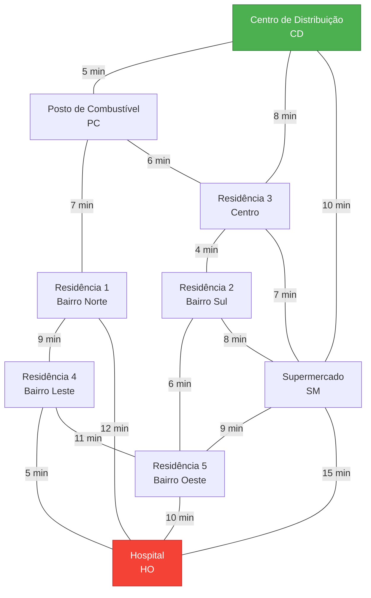
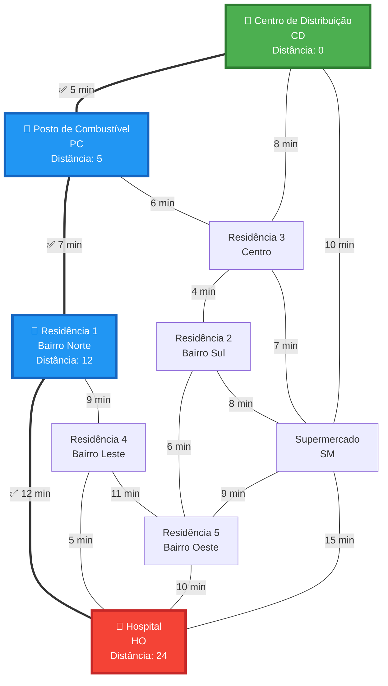
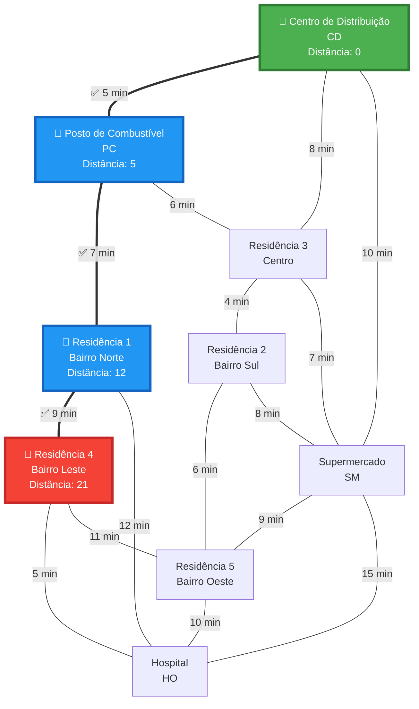
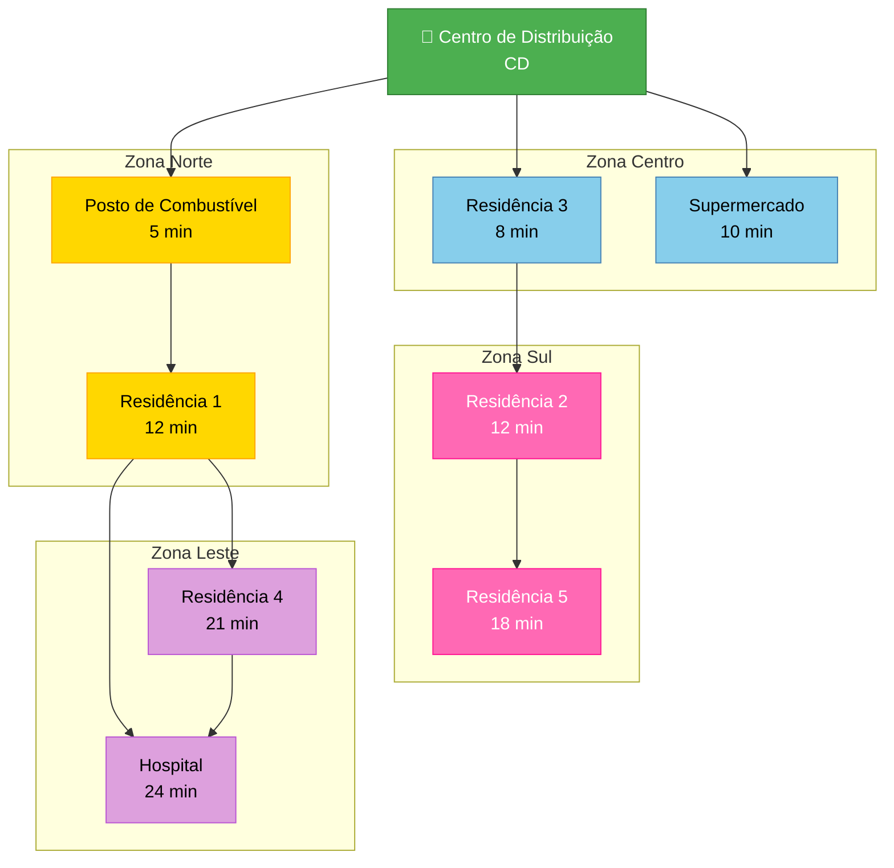
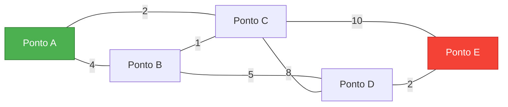
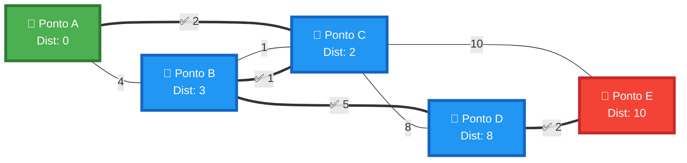

# Visualização do Grafo - Algoritmo de Dijkstra

Este documento apresenta a visualização do grafo usado no exemplo prático de otimização de rotas de entrega do arquivo `dijkstra.js`.

## 📍 Mapa da Cidade - Grafo Completo



## 🚚 Exemplo 1: Rota Otimizada (CD → Hospital)

Caminho mais curto: **CD → PC → R1 → HO** (24 minutos)



## 🎯 Exemplo 2: Rota Otimizada (CD → R4)

Caminho mais curto: **CD → PC → R1 → R4** (21 minutos)



## 📊 Tabela de Distâncias Mínimas

A partir do **Centro de Distribuição (CD)**:

| Destino | Tempo (min) | Caminho |
|---------|-------------|---------|
| Posto de Combustível (PC) | 5 | CD → PC |
| Residência 3 - Centro (R3) | 8 | CD → R3 |
| Supermercado (SM) | 10 | CD → SM |
| Residência 1 - Bairro Norte (R1) | 12 | CD → PC → R1 |
| Residência 2 - Bairro Sul (R2) | 12 | CD → R3 → R2 |
| Residência 5 - Bairro Oeste (R5) | 18 | CD → R3 → R2 → R5 |
| Residência 4 - Bairro Leste (R4) | 21 | CD → PC → R1 → R4 |
| Hospital (HO) | 24 | CD → PC → R1 → HO |

## 🎨 Exemplo 3: Múltiplas Rotas Visualizadas

Visualização de todas as rotas a partir do Centro de Distribuição:



## 📈 Grafo de Exemplo Simples

Este é o grafo usado no exemplo básico do código:



**Caminho mais curto de A até E**: A → C → B → D → E (10 unidades)



## 🔍 Legenda

- **🏁** = Ponto de partida (origem)
- **🎯** = Destino
- **📍** = Ponto intermediário na rota ótima
- **===** = Aresta usada no caminho mais curto
- **---** = Aresta não usada no caminho ótimo
- **Verde** = Nó inicial
- **Vermelho** = Nó destino
- **Azul** = Nós no caminho ótimo

## 💡 Como Usar

Para visualizar estes diagramas:

1. **GitHub**: Os diagramas Mermaid são renderizados automaticamente no GitHub
2. **VS Code**: Instale a extensão "Markdown Preview Mermaid Support"
3. **Online**: Use o [Mermaid Live Editor](https://mermaid.live)
4. **Obsidian**: Suporte nativo para Mermaid
5. **Notion**: Suporte nativo para Mermaid

## 📝 Estrutura do Código

O grafo é criado no arquivo `dijkstra.js` usando:

```javascript
const cidade = new Graph();

// Adiciona locais
cidade.addNode("CD", "Centro de Distribuição");
cidade.addNode("PC", "Posto de Combustível");
// ... outros nós

// Adiciona rotas com tempos
cidade.addEdge("CD", "PC", 5);   // CD ↔ PC: 5 minutos
cidade.addEdge("CD", "R3", 8);   // CD ↔ R3: 8 minutos
// ... outras arestas
```

## 🎓 Complexidade

- **Temporal**: O(V²) com array simples, O((V + E) log V) com priority queue
- **Espacial**: O(V) para armazenar distâncias e caminhos

Onde:

- V = Número de vértices (9 no exemplo da cidade)
- E = Número de arestas (16 no exemplo da cidade)

---

**Gerado a partir de**: `dijkstra.js`
**Algoritmo**: Dijkstra - Caminho Mais Curto em Grafos
**Use Case**: Sistema de Otimização de Rotas de Entrega
